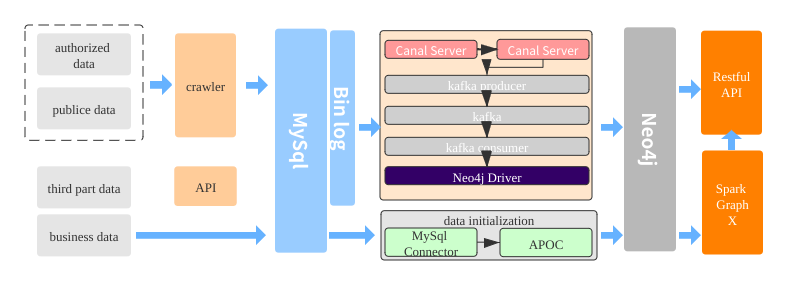

## Financial Risk Control Model Construction based On Knowledge Graph

This project is for financial risk control model construction based on KG. In this project, two goal are need to implement. The first is construct a financial prediction model, the sencod is construct real-time system.

### 1. System Architect

The picture show the whole architect of the system. 



### 2. Implementation

The project implemented on `Spring Boot` 
**Rule Developement**

To extract the feature for applicant, we pre-defined three rules to judge applicant are more likely to be delinquent
+ The number of delinquent application of applicant.
For its `Cypher query`, are
```
match (p:Person)-[h:HAS_APPLICATION]->(a:Application) where a.status=”OVER_DUE” and a.personId=$personId return count(a)
```
+ How many People are in blacklist in the one degree relationship of applicant
For its `Cypher query`, are
```
match (p:Person)-[]-(p1:Person)-[h:HAS_PHONE]-(b:Black) where p.personId= $personId return count(b)
```

+ How many People are in blacklist in the two degrees relationship of applicant
For its `Cypher query`, are
```
macth (p:Person)-[]-(p2:Person)-[]-(p2:Person)-[h:HAS_PHONE]-(b:Black) where p.personId = $personId return count(b)
```
Save three rules in `Mysql`

**Intergration of Mysql and Neo4j in Spring Boot**

Extract rule from `Mysql` and then use this query to query `neo4j` database that obtain three features for applicant.

#### Continue
